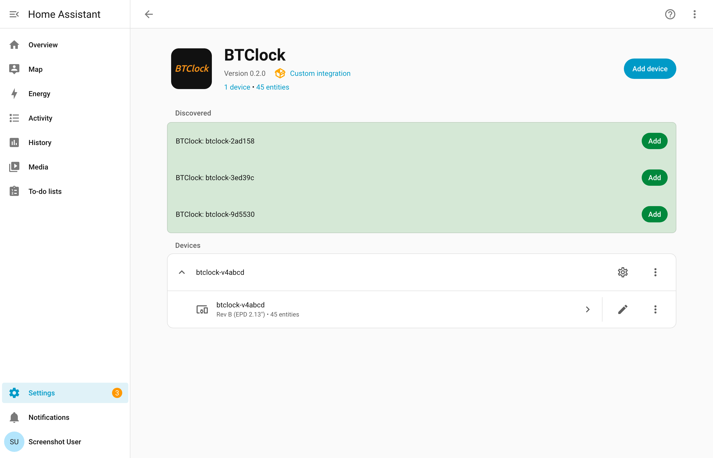
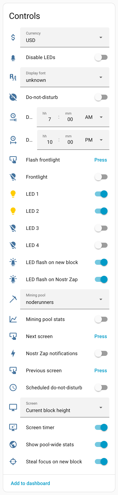
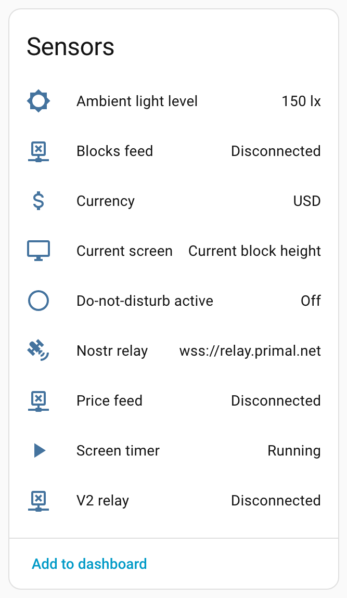
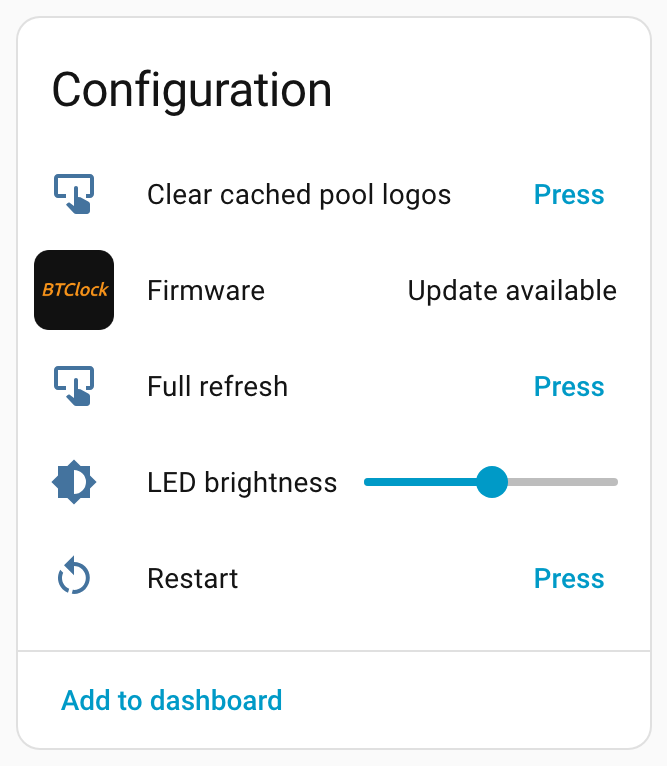
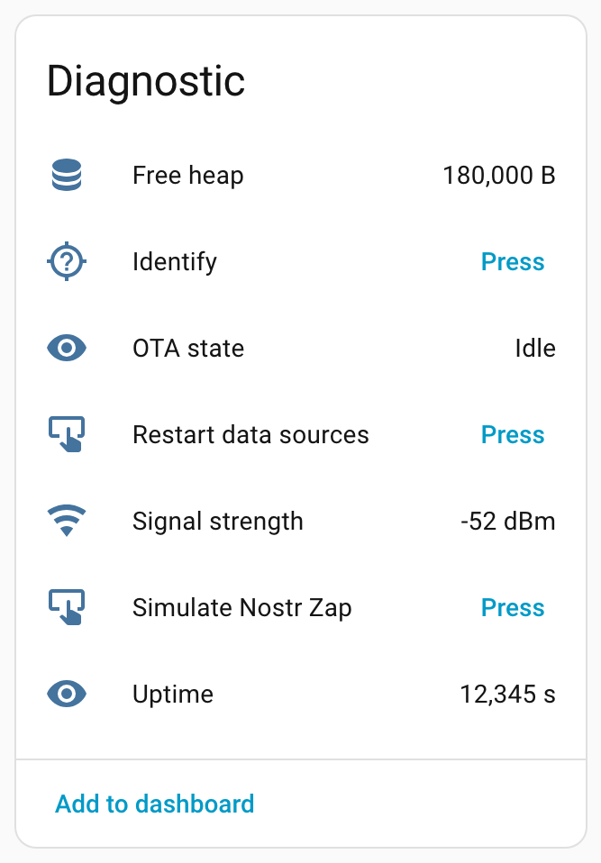
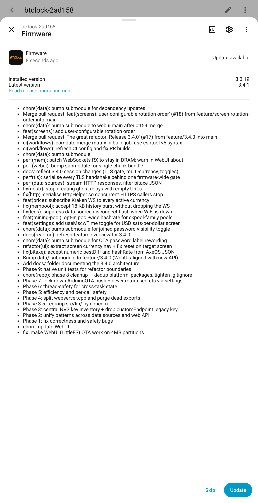

# BTClock Integration

_Home Assistant integration for the [BTClock](https://git.btclock.dev/btclock/btclock_v4) — an open-source Bitcoin price / block-height display. Maintained by the same author as the firmware._

## Supported firmware

| Firmware               | Status        | Notes                                                                                                                              |
|------------------------|---------------|------------------------------------------------------------------------------------------------------------------------------------|
| **v4** (4.x, ESP-IDF)  | Full + extras | Everything v3.4 has, plus mining-pool / font selectors, Bitaxe data source, three diagnostic actions, eight v4-only setting toggles, three poll-cadence sliders |
| **v3.4.x** (Arduino)   | Full          | POST-style API, SSE push updates, HTTP auth, DND, frontlight                                                                        |
| **≤3.3.x** (legacy)    | Basic         | GET-style API; read-only DND and no frontlight controls                                                                             |

The variant is detected automatically from `GET /api/settings` — `gitTag` on v3.x, `gitRev` on v4 (which fills only `gitRev` from `git describe`). Entities that depend on a specific variant or on a setting key the firmware doesn't expose are suppressed automatically, so a v3.4 device won't show v4-only entities and vice versa.

## Platforms

v4-only entities are marked **v4**.

| Platform        | Entities                                                                  |
|-----------------|---------------------------------------------------------------------------|
| `sensor`        | Current screen, currency, uptime, RSSI, free heap, ambient light level    |
| `binary_sensor` | Price / blocks / V2 / nostr feed connectivity, screen timer, OTA, DND     |
| `switch`        | Screen timer, Do-not-disturb, scheduled Do-not-disturb (3.4.0+); **v4**: Bitaxe data source, mining-pool stats, pool-wide stats, MoW mode, sats symbol, block countdown, hide leading zero, inverted colors |
| `select`        | Screen (rotation-ordered on 3.4.1+), currency (3.4.0+); **v4**: mining pool, display font |
| `time`          | Do-not-disturb schedule start / end (3.4.0+)                              |
| `light`         | One entity per status LED, plus frontlight (when hardware present)        |
| `number`        | LED brightness slider (0–255); **v4**: Bitaxe poll interval, mining-pool poll interval, full-refresh interval |
| `button`        | Identify, restart, full refresh, next / previous screen, flash frontlight (3.4.0+); **v4**: simulate Nostr Zap, clear cached pool logos, restart data sources |
| `update`        | Firmware update (auto-update or specific version, 3.4.0+ release builds)  |

The screenshots below are taken from a Rev B device running v4 firmware (the v4-only switches/selects/buttons are visible alongside everything inherited from v3.4); on a v3.4 device the v4-marked rows are simply absent.

| Controls | Sensors | Configuration | Diagnostic |
|---|---|---|---|
|  |  |  |  |

## Services

| Service                | Purpose                                                          |
|------------------------|------------------------------------------------------------------|
| `btclock.show_text`    | Display a string across the device's screens (one char each, auto-uppercased, clamped to `numScreens`) |
| `btclock.show_custom`  | Display one string per screen — handy for symbols or multi-char labels |

## Firmware updates

If the BTClock is running a real release (e.g. `3.3.19`, not a commit-hash dev build), the integration polls its configured `gitReleaseUrl` once a day and surfaces a firmware update entity — it also shows up in **Settings → Updates**. Release notes default to the release body; when that's empty, they're synthesized from the first-line commit messages of the compare API between the installed and latest tags.

  

Installing the latest version fires `POST /api/firmware/auto_update` and lets the device download + flash itself. Installing an older version downloads the matching `{board}_firmware.bin` and `littlefs_{size}.bin` assets and uploads them to `/upload/firmware` and `/upload/webui`; the device reboots into the new image at the end.

## Data-source sensors

`connectionStatus` exposes four separate feeds — `price`, `blocks`, `V2`, `nostr` — because a BTClock can be driven by any combination of them depending on its `dataSource` setting. The integration exposes a binary sensor per feed:

- **Price / Blocks feed** — always enabled by default (the common case — BTClock driven by the built-in mempool source).
- **V2 / Nostr feed** — hidden by default, but **auto-enabled at integration setup if the feed is already connected**. If you later switch the device's `dataSource`, toggle the sensor visibility manually in Home Assistant's entity registry or reconfigure the integration.

## Live updates

During setup you pick one of two strategies; swap later via **Settings → Devices & Services → BTClock → Configure**.

- **Server-Sent Events (default)** — the integration subscribes to the BTClock's `/events` stream and receives status pushes the moment they happen. Lowest latency, zero polling traffic. The SSE client auto-reconnects with jittered backoff if the connection drops.
- **Polling** — plain periodic `GET /api/status`. Choose this if SSE is unreliable on your network (e.g. through a flaky reverse proxy or VPN). The scan interval is configurable (5 – 3600 seconds, default 30).

## HTTP Basic Auth

If the BTClock has `httpAuthEnabled` turned on, the config flow will prompt for credentials. When credentials stop working (e.g. you rotated the password on the device), Home Assistant will surface a reauth prompt.

## Installation via HACS

HACS currently only accepts GitHub repositories, so use the GitHub mirror — the git.btclock.dev Forgejo instance won't work.

1.  — or manually: HACS → Integrations → menu → **Custom repositories** → add `https://github.com/dsbaars/homeassistant-btclock` with category **Integration**.
2. Install "BTClock Integration" and restart Home Assistant.
3.  — or **Settings → Devices & Services → Add Integration → BTClock**, or accept the auto-discovered zeroconf prompt.

## Manual installation

1. Copy `custom_components/btclock/` into your Home Assistant configuration's `custom_components/` directory.
2. Restart Home Assistant.
3. Add the integration from **Settings → Devices & Services**.

## Development

See [CONTRIBUTING.md](CONTRIBUTING.md). Recommended workflow is to use the VSCode Dev Container (`.devcontainer.json` ships Python 3.13 + HA latest + test deps). Useful scripts:

- `scripts/setup`  – install runtime + test deps
- `scripts/test`   – run `pytest tests/`
- `scripts/check`  – ruff lint + format check + pytest
- `scripts/develop` – boot a debug Home Assistant on port 8123 with this integration loaded (set `BTCLOCK_DEBUGPY=1` to attach on port 5678)
- `scripts/screenshot` – regenerate the PNGs under `docs/screenshots/` (boots a one-shot HA against a stub BTClock seeded from the v4 fixture; auto-installs Playwright + Chromium on first run)

## Contributing

Issues and pull requests welcome at <https://git.btclock.dev/btclock/homeassistant-btclock> or the GitHub mirror.
